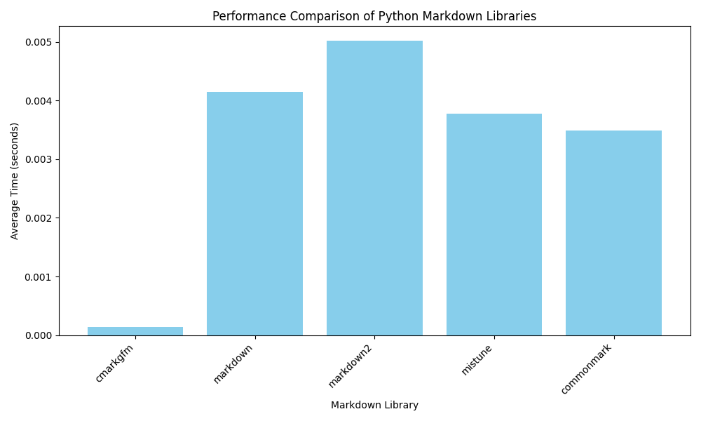

# Python Markdown Library Comparison

This report provides a feature and performance comparison of five popular Python markdown libraries: `cmarkgfm`, `markdown`, `markdown2`, `mistune`, and `commonmark-py`.

## Feature Comparison

| Feature                  | cmarkgfm | markdown | markdown2 | mistune | commonmark-py |
| ------------------------ | :------: | :------: | :-------: | :-----: | :-----------: |
| **CommonMark Compliant** |   Yes    |    No    |    No     |   Yes   |      Yes      |
| **GitHub Flavored MD**   |   Yes    |    No    |    No     |   No    |      No       |
| **Extensibility**        | Limited  |   Yes    |    Yes    |   Yes   |      Yes      |
| **Table Support**        |   Yes    | Yes (ext)| Yes (ext)|   Yes   |      Yes      |
| **Footnotes Support**    |   Yes    | Yes (ext)| Yes (ext)|   Yes   |      No       |
| **Syntax Highlighting**  |    No    | Yes (ext)| Yes (ext)|   Yes   |      No       |
| **Strikethrough Support** |   Yes    | Yes (ext)| Yes (ext)|   Yes   |      No       |

## Performance Benchmark

The following chart displays the average time (in seconds) each library took to convert a large markdown document to HTML. The benchmark was run 10 times for each library, and the average time is reported.



### Benchmark Results

| Library       | Average Time (seconds) |
| ------------- | ---------------------- |
| cmarkgfm      | 0.000138               |
| markdown      | 0.004141               |
| markdown2     | 0.005016               |
| mistune       | 0.003781               |
| commonmark    | 0.003488               |

As the results show, `cmarkgfm` is significantly faster than the other libraries.

## How to Run the Benchmark

You can run the benchmark yourself to reproduce these results.

### Prerequisites

*   Python 3
*   `pip` for installing packages

### Installation

1.  Clone this repository.
2.  Install the required Python libraries:

    ```bash
    pip install cmarkgfm markdown markdown2 mistune commonmark-py
    ```

### Running the Script

Execute the `benchmark.py` script from the root of the project directory:

```bash
python benchmark.py
```

The script will print the average conversion time for each library to the console and save the results in `results.json`. You can also use `plot.py` to regenerate the performance chart.
